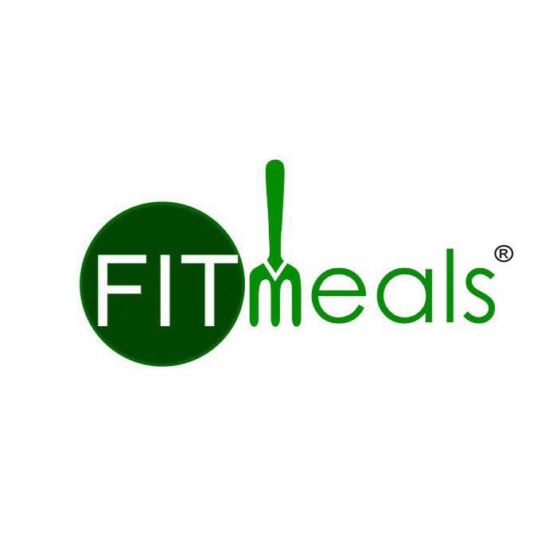
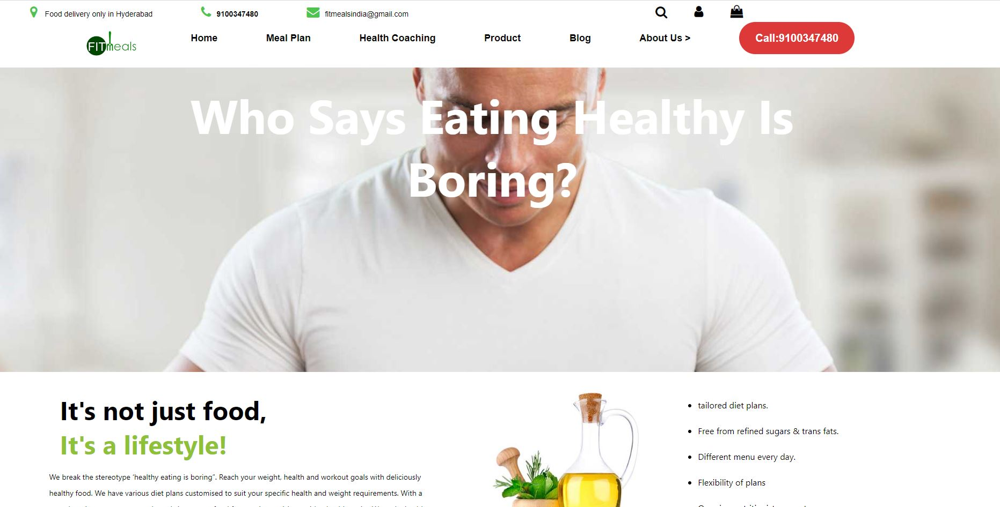
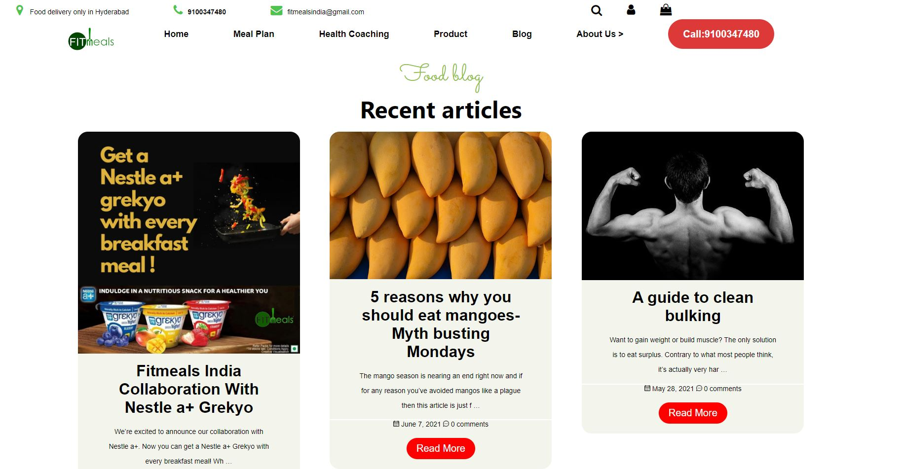
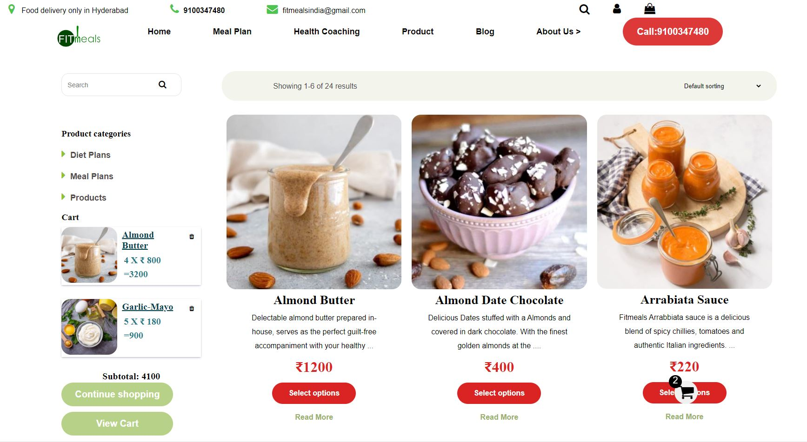
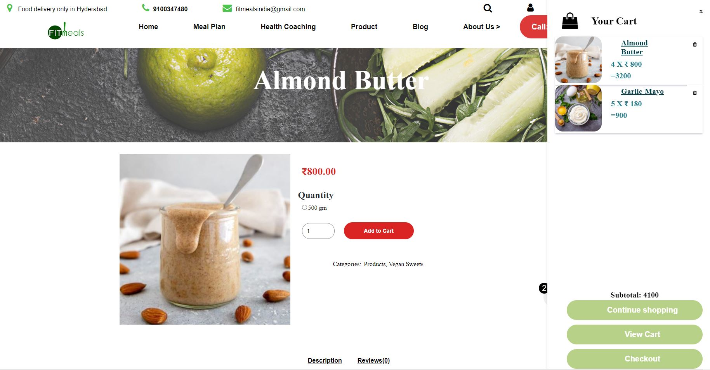
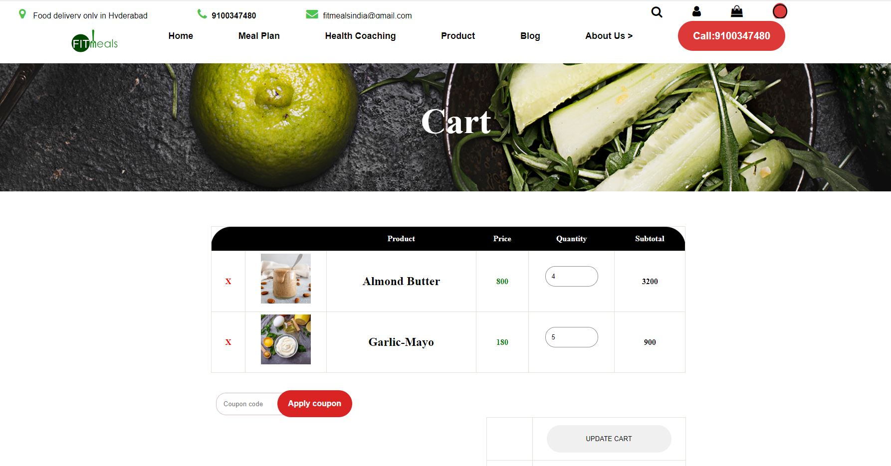

# Project-Fitmeal-clone

Fitmeals India, the first delivery service of its kind in India.The intention was to introduce the concept of healthy eating in Hyderabad where people always associated healthy food with terms like ‘expensive’, ‘boring’ and ’bland’.

**Our team was given a task to Clone the [Fit meal](https://www.fitmeals.co.in/) Website.**

# To visit our website [Click here](https://fit-meal.netlify.app)

## Technologies Used
 We are using HTML,CSS,JavaScript.

    <a href="https://developer.mozilla.org/en-US/docs/Web/JavaScript" target="_blank">  &nbsp;&nbsp;&nbsp;&nbsp;&nbsp; </a> 
    <a href="https://www.w3.org/html/" target="_blank"> &nbsp;&nbsp;&nbsp;&nbsp;&nbsp;</a>
    <a href="https://www.w3schools.com/css/" target="_blank">  &nbsp;&nbsp;&nbsp;&nbsp;&nbsp;</a> 
  

  

## Features

- Fullscreen mode
- Easy navigation by category section\_

### We have focused mainly on:

1.Landing Page

<h4>This is our landing page </h4>

2.Product Page

<h4>Here user can search and filter the data as per their requirement:- </h4>

3.Single Product page

<h4> Users can choose Product Quantity here </h4>

4.Payment page

<h4>Cart Page</h4>

## Team Members and Contributors

- [@Manoj Attri](https://github.com/manojattri181)
- [@Atul Krishna](https://github.com/atul85400krishna)
- [@Gaurav Kumar Pandey](https://github.com/GauravPandey08)
- [@Saurabh Patel](https://github.com/Saurabhpatel0894)
- [@Sumit Jayswal](https://github.com/SumitJayswal)
